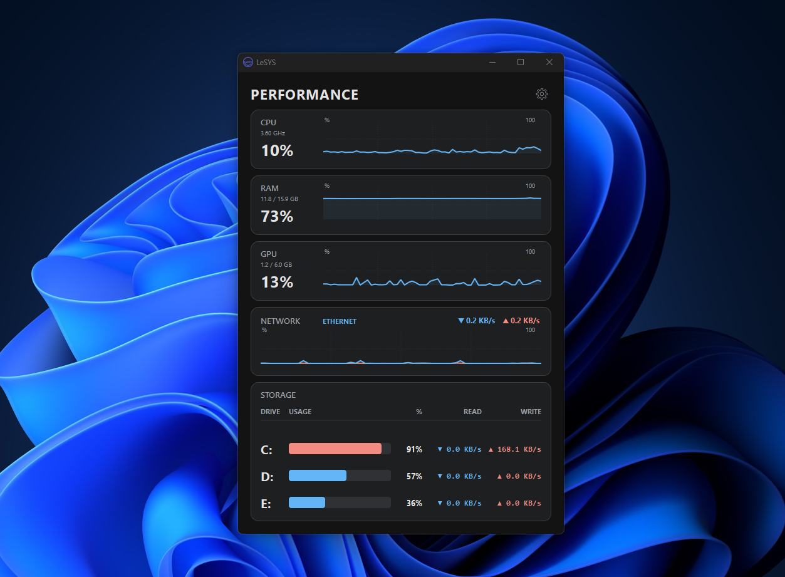
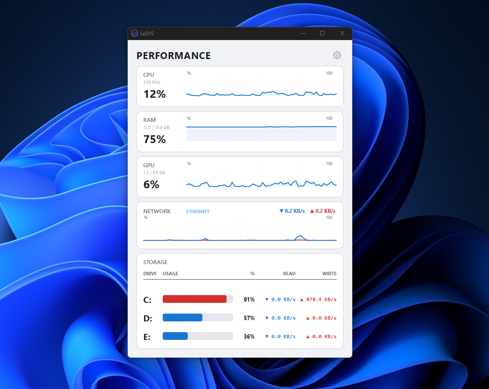

# ⚡ LeSYS Monitor


**LeSYS** es un monitor de sistema moderno, estético y ligero desarrollado en Python. Diseñado para ofrecer una visualización clara y en tiempo real del rendimiento de tu hardware con una interfaz gráfica pulida y animaciones fluidas.

## LeSYSTema Oscuro


## LeSYS Tema Claro


---

## ✨ Características Principales

* **🎨 UI Moderna y Responsiva:** Interfaz basada en tarjetas con esquinas redondeadas, sombras sutiles y gráficos de área (`AreaGraph`) personalizados.
* **🚀 Pantalla de Carga Animada:** Inicio estilo "Discord" con frases dinámicas y un *Easter Egg* en el acrónimo de carga.
* **📊 Monitorización Detallada:**
    * **CPU:** Uso total (%) y Frecuencia en tiempo real (GHz).
    * **RAM:** Porcentaje de uso, Memoria usada y Total (GB).
    * **GPU:** Soporte nativo para **NVIDIA** y compatibilidad con **WMI** para gráficas integradas. Muestra carga y VRAM.
    * **Red:** Velocidad de subida/bajada precisa con detección automática de interfaz activa (filtra adaptadores virtuales).
    * **Almacenamiento:** Uso de espacio y velocidad de lectura/escritura por disco.
    * **Procesos (Avanzado):** Vista de procesos con PID, uso de RAM, CPU y Disco. Permite **agrupar** procesos idénticos, **ordenar** al hacer clic en el encabezado y **finalizar tareas** con el clic derecho.
* **🌗 Temas:** Cambio instantáneo entre **Modo Claro** y **Modo Oscuro**.
* **byte/bit Toggle:** Alterna la visualización de red entre `Mbps` (bits) y `MB/s` (bytes) con un clic.

---

## 🛠️ Tecnologías Usadas

El proyecto está construido sobre un stack robusto y eficiente:

* **[PySide6 (Qt)](https://doc.qt.io/qtforpython/):** Motor de interfaz gráfica.
* **[psutil](https://psutil.readthedocs.io/):** Extracción de métricas del sistema y hardware.
* **[WMI](https://pypi.org/project/WMI/):** Integración profunda con Windows para datos de disco y GPU.
* **[nvidia-ml-py](https://pypi.org/project/nvidia-ml-py/):** Lectura directa de sensores de tarjetas gráficas NVIDIA.

---

## 📦 Instalación y Uso

Sigue estos pasos para ejecutar LeSYS en tu ordenador:

### 1. Clonar el repositorio
```bash
git clone [https://github.com/zein9999/LeSYS-Monitor.git](https://github.com/zein9999/LeSYS-Monitor.git)
cd LeSYS-Monitor
```

### 2. Crear entorno virtual (Recomendado)
```bash
python -m venv .venv
# En Windows:
.venv\Scripts\activate
```

### 3. Instalar dependencias
```bash
pip install -r requirements.txt
```

### 4. Ejecutar la aplicación

```bash
python main.py
```

## 📂 Estructura del Proyecto

```plaintext
LeSYS-Monitor/
├── assets/             # Iconos y recursos gráficos de la aplicación (Logo, Iconos de ajustes)
├── screenshots/        # Imágenes de previsualización para la documentación (README)
├── widgets.py          # Componentes de UI (Gráficos, Tablas, Árbol de Procesos)
├── workers.py          # Hilos de fondo (Lógica de obtención de datos)
├── splash.py           # Pantalla de carga animada
├── config.py           # Configuración de temas y estilos
├── utils.py            # Funciones auxiliares de formateo (Números, Velocidad)
├── main.py             # Punto de entrada de la aplicación
└── requirements.txt    # Lista de dependencias
```
